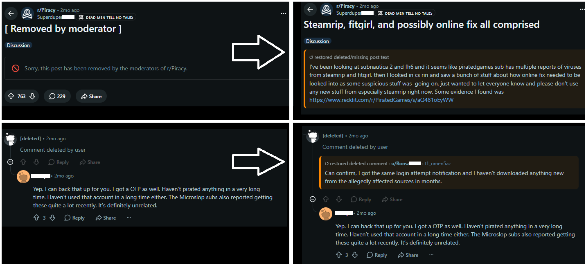
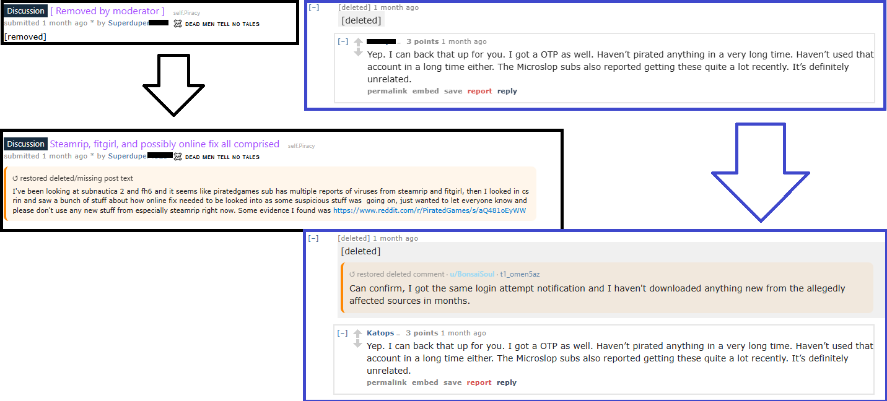

# Reddit Restore

Reddit Restore is a userscript that restores deleted or removed Reddit posts, comments, usernames, images, videos, and media directly inside Reddit threads.

It uses Arctic Shift first, with PullPush fallback.

## Install

Install from GreasyFork:

[Reddit Restore on GreasyFork](https://greasyfork.org/en/scripts/585120-reddit-restore)

Requires a userscript manager such as:

- Tampermonkey
- Violentmonkey
- Greasemonkey

## Features

- Restores deleted/removed post text
- Restores deleted/removed comment text
- Reveals archived usernames when available
- Restores Reddit images, galleries, GIFs, videos, and source links when archived
- Redgifs support with fallback links
- Old Reddit and new Reddit support
- Local cache for faster rescans
- Status indicator with restore/failure states
- Toggle restored/original view

## Limitations

Reddit Restore can only restore content that exists in public archives.

Some media may be gone from the original host. In that case, the script will show the archived source link or a missing-media notice.

## Supported sources

- Arctic Shift
- PullPush fallback

## Screenshots

## Screenshots

### New Reddit

### Old Reddit

## Bug reports

If something does not restore, please open an issue with:

- Reddit post/comment link
- Browser
- Userscript manager
- Reddit version: new / old
- Screenshot if possible
- Console errors if available